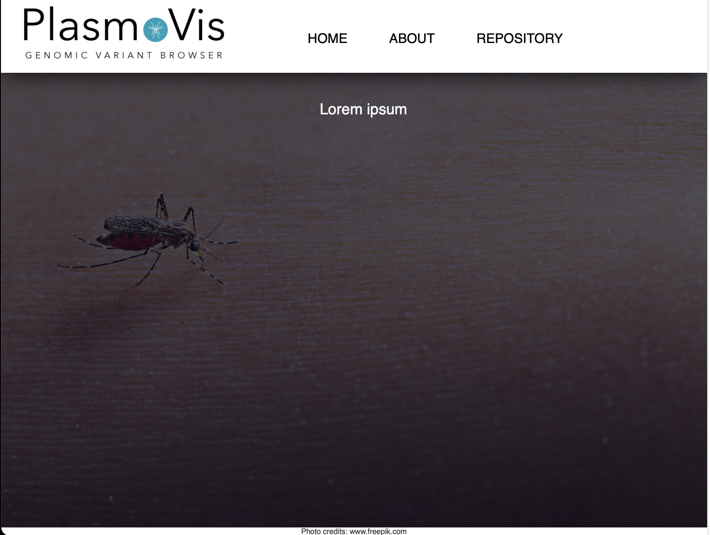
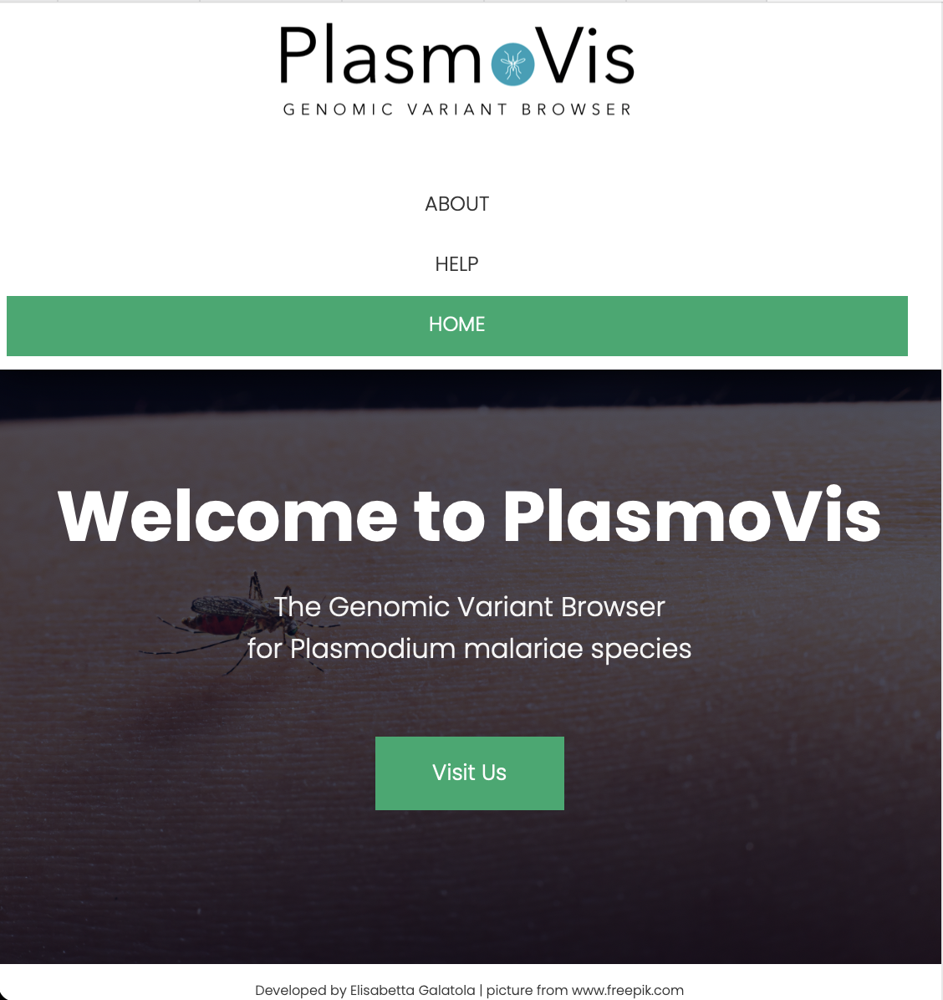

<br><br>
 </img>

#

PlasmoVis is a species-specific genomic variant browser specifically developped to inspect Plasmodium malariae variations.

## Table of Contents
> - [Preview](#Preview)
> - [Prerequisites](#Prerequisites)<br>
> - [Author](#Author)<br>

# Preview
Complete web page view<br>


## Responsive view
If the user is using a smaller screen, the menu will adapt accordingly



# Prerequisites
Prerequisites<br>

- [RStudio](https://www.rstudio.com/products/rstudio/download/ "RStudio") (free version) <br>
- [R](https://cran.r-project.org "R") 

BSAvis package requires merged Variant Calling Format (`VCF`) files as input files, generated using `GATK4`.<br> 

- [Alignment Steps](https://github.com/FadyMohareb/BSAvis_GP_2020/blob/main/QC_Alignment_VC/alignment_variantCalling/steps/alignment_steps.txt "Alignment Steps")
- [Variant Calling Steps](https://github.com/FadyMohareb/BSAvis_GP_2020/blob/main/QC_Alignment_VC/alignment_variantCalling/steps/variantCalling_steps.txt "Variant Calling Steps")


* `test.RData`
* `test.vcf` 


```R
# script
```

# Author
```
Developed by Elisabetta Galatola

Applied Bioinformatics MSc
Cranfield University - Cranfield, Bedford, UK
Academic Year: 2020-202
```