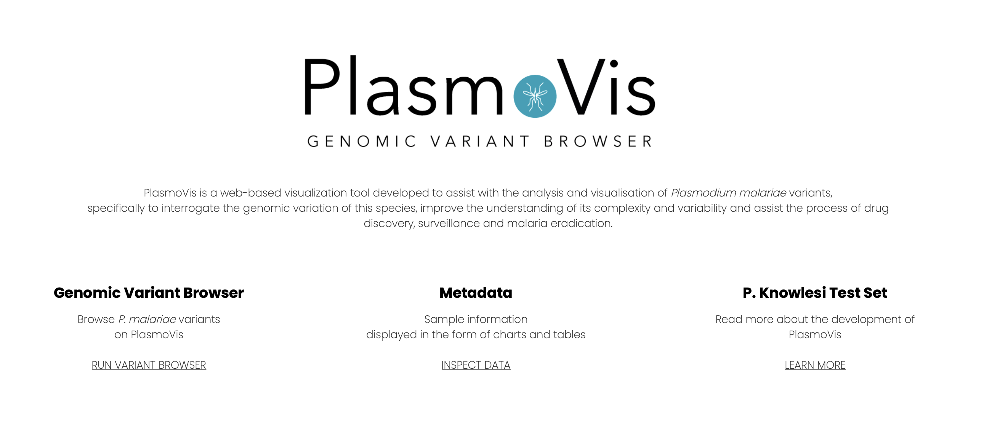
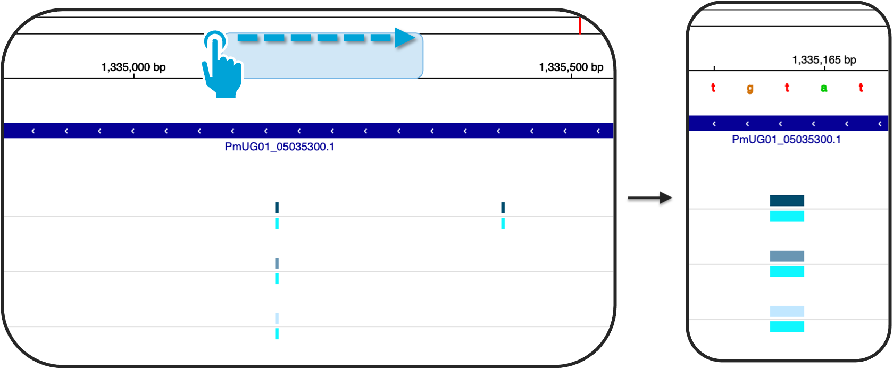
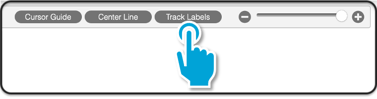
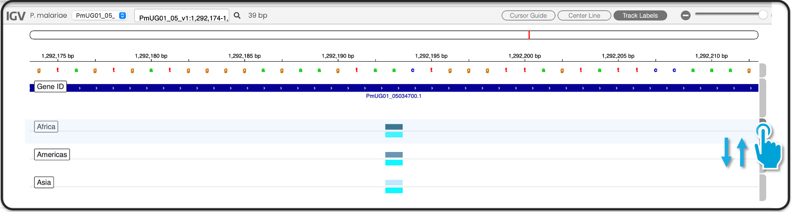

<br><br>
 </img>

PlasmoVis is a  user-friendly web-based visualisation tool to assist with the analysis and visualisation of sequencing data, specifically to interrogate the genomic variation of <i>Plasmodium malariae</i> parasites. 

## Table of Contents
> - [About](#about)<br>
> - [Prerequisites](#prerequisites)<br>
> - [Setup](#setup)<br>
>   - [Download PlasmoVis](#1-download-plasmovis) <br>
>   - [Install PlasmoVis Dependendencies](#2-install-plasmovis-dependencies) <br>
>   - [Run PlasmoVis](#3-run-plasmovis)<br>
>   - [Close PlasmoVis](#4-close-plasmovis)<br>
> - [PlasmoVis](#PlasmoVis)<br>
>   - [Home Page](#home-page)<br>
>   - [Genomic Variant Browser]()<br>
>   - [Data]()<br>
>   - [About - P. knowlesi]()<br>
> - [Author](#Author)<br>

# Prerequisites
PlasmoVis is is compatible for being run either on Mac or Windows Operating Systems.<br>
Please ensure you have <b>Node.js</b> installed on your computer before proceeding.

- [Node.js](https://nodejs.org/it/download/ "Node.js")
# Setup
## 1. Download PlasmoVis

PlasmoVis can be downloaded in two ways:

- Click on the green `Code` button on the upper-right corner above and select `Download ZIP` <b>(Figure 1)
</b>. Remember to unzip the file before proceeding.

<p align="center"></img></p><br><b>Figure 1.</b> Download PlasmoVis - GitHub screenshot.<br><br>

- Alternatively, in case you have [Git](https://git-scm.com/downloads "Install Git") installed on your computer, run the following commands on your terminal:

```sh
# set your working directory (i.e. folder in which you would like to save PlasmoVis)
cd <yourdir/yourfolder>
# clone the repository
git clone https://github.com/EG-lisy/PlasmoVis.git
```

## 2. Install PlasmoVis Dependencies

Proceede installing PlasmoVis dependencies (node modules).

1. From the terminal, set your working directory inside `PlasmoVis/PlasmoVis`. Please note that the project subfolder has the same name of the main one.

```sh
# set your working directory (i.e. folder in which you would like to save PlasmoVis)
cd <yourworkingdirectory>/PlasmoVis/PlasmoVis
# install dependencies
npm install
```

Once the installation is completed, a `node_modules` folder containing all the required dependencies will be created inside `PlasmoVis/PlasmoVis`.

## 3. Run PlasmoVis

1. Without changing the working directory, run the following command from the terminal:

```sh
node app.js
```

> <b>Note for Developers</b><br>
> Nodemon has been installed to allow changes being automatically updated on the server.<br> If you wish to edit the code and run PlasmoVis in the developer mode, run `npm start` instead.

2. If all the steps have been followed correclty, the following welcoming message will be displayed on your Console:

```console
MacBook-Pro-di-Elisabetta:PlasmoVis lisy$ node app.js

Server is listening on port: 3000
-------------------------------- PlasmoVis --------------------------------
Welcome to PlasmoVis!
1. Open your browser of choice
2. Visit: http://localhost:3000
```

3. You will be now able to visit PlasmoVis on [http://localhost:3000](http://localhost:3000 "PlasmoVis").


## 4. Close PlasmoVis

To stop PlasmoVis from running, type `Ctrl+C` on your terminal.


# PlasmoVis

This section aims to assist with the navigation of PlasmoVis web-pages.

## Home Page

From [http://localhost:3000](http://localhost:3000 "PlasmoVis") you will end up on the landing page of PlasmoVis <b>(Figure 2)</b>.


<br><b>Figure 2.</b> PlasmoVis Landing Page.<br>

### Bottom Navigation

Below the welcoming message, self-explanatory clickable links are also included <b>(Figure 3)</b>.

<br><b>Figure 3.</b> PlasmoVis bottom-section navigation links.<br>


<br><i>P. malariae</i> variants can be inspected either by clicking on the green `Run PlasmoVis` button (refer to <b>Figure 2</b>) or by using the navigation bar (read below).<br>

## Navigation bar

The navigation bar on the upper-section allows switching in between pages <b>(Figure 4)</b>.<br><br>

<p align="center"></img></p><b>Figure 4.</b>PlasmoVis Navigation Bar<br><br><br>

Where: 
> 1. <b>PlasmoVis logo</b> takes back to the [home page](#home-page)
> 2. <b>GENOME BROWSER</b> takes to the [Genomic Variant Browser](#genomic-variant-browser) page 
> 3. <b>DATA</b> takes to the [Data](#data) page
> 4. <b>ABOUT</b> includes additional information on <i>P. knowlesi</i> data used whilst developing PlasmoVis
> 5. <b>HOME</b> takes back to [home page](#home-page)


## Genomic Variant Browser

This page allows to inspect <i>P. malariae</i> variants over an `IGV.js` framework<b>(Figure 5)</b>.

### Overview 

<p align="center"></img></p><b>Figure 5.</b> Screenshot of the Genomic Variant Browser<br><br>

Where:
> 1. <i>Plasmodium Malariae</i> Genome (`PmUG01`)
> 2. Annotation (gene IDs)
> 3. Intersected samples variants based on continent of origin (Africa, Americas and Asia)
> 4. SNPs (Single Nucleotide Polymorphisms). 


### Tracks

Genome, annotation and variants tracks are all interactive.

By clicking on a specific gene track, an info box pops up displaying the gene ID/parent ID, which can be copied to your clipboard to identify the gene name using the gene table found at the bottom of the genomic variant browser (see [Gene Search](#gene-search) section). 

SNPs tracks display two subtracks. The upper subtrack is coloured in different shades of blue based on the continent of origin; by clicking on it, an info box pops up displaying all the informaiton stored inside the VCF file. Likewise, the lower subtrack pops up an info box displaying genotype information.

See <b>Figure 6</b> below for a better understanding.

<p align="center"></img></p><b>Figure 6.</b> Tracks Info Boxes<br><br>

> <b>Upper subtrack:</b><br>
> <b>CHR</b> chromosome name<br>
> <b>Pos</b> SNP position<br>
> <b>Names</b> SNP name added during the annotation pipeline used to calculate fixation indices (R script)<br>
> <b>Ref</b> reference allele<br>
> <b>ALT</b> alternative allele<br>
> <b>Qual</b> a phred-scaled quality score assigned by the variant caller<br>
> <b>Filter</b> PASS if specific position has passed all given filters when generating the vcf file<br>
> <b>AC</b> allele count in genotypes, for each ALT allele, in the same order as listed<br>
> <b>AF</b> allele Frequency, for each ALT allele, in the same order as listed<br>
> <b>AN</b> total number of alleles in called genotypes<br>
> <b>BaseQRankSum</b> z-score from Wilcoxon rank sum test of Alt Vs. Ref base qualities<br>
> <b>DP</b> approximate read depth; some reads may have been filtered<br>
> <b>ExcessHet</b> phred-scaled p-value for exact test of excess heterozygosity<br>
> <b>FS</b> phred-scaled p-value using Fisher's exact test to detect strand bias<br>
> <b>InbreedingCoeff</b> inbreeding coefficient as estimated from the genotype likelihoods per-sample when compared against the Hardy-Weinberg expectation<br>
> <b>MLEAC</b> maximum likelihood expectation (MLE) for the allele counts (not necessarily the same as the AC), for each ALT allele, in the same order as listed<br>
> <b>MLEAF</b> maximum likelihood expectation (MLE) for the allele frequency (not necessarily the same as the AF), for each ALT allele, in the same order as listed<br>
> <b>MQ</b> RMS (root mean square) Mapping Quality<br>
> <b>MQRankSum</b> z-score From Wilcoxon rank sum test of Alt vs. Ref read mapping qualities<br>
> <b>QD</b> variant Confidence/Quality by Depth<br>
> <b>ReadPosRankSum</b> z-score from Wilcoxon rank sum test of Alt vs. Ref read position bias<br>
> <b>SOR</b> symmetric Odds Ratio of 2x2 contingency table to detect strand bias<br>
> <b>VQSLOD</b> log odds of being a true variant versus being false under the trained gaussian mixture model<br>
> <b>culprit</b>  the annotation which was the worst performing in the Gaussian mixture model, explains the reason why the variant was filtered out (e.g. FisherStrand (FS), QualByDepth (QD), StrandOddsRatio (SOR), RMSMappingQuality (MQ), MappingQualityRankSumTest (MQRankSum), ReadPosRankSumTest (ReadPosRankSum)…)<br>
> <b>BCSQ</b> haplotype-aware consequence annotation from BCFtools/csq, see http://samtools.github.io/bcftools/howtos/csq-calling.html for details. Format: Consequence|gene|transcript|biotype|strand|amino_acid_change|dna_change<br>
> <b>Fst</b> Fixaction index (range 0-1)<br>

> <b>Lower subtrack:</b><br>
> <b>Name</b> sample name (continent)<br>
> <b>Genotype</b> genotype info. Please note that Plasmodium species are haploid. This diploid output is due to the GATK pipeline<br>
> <b>DP</b> approximate read depth (reads with MQ=255 or with bad mates are filtered)<br> 
> <b>GQ</b> genotype quality<br>
> <b>PGT</b> pysical phasing haplotype information, describing how the alternate alleles are phased in relation to one another; will always be heterozygous and
 is not intended to describe called alleles <br>
> <b>PID</b> physical phasing ID information, where each unique ID within a given sample (but not across samples) connects records within a phasing group <br>
> <b>PL</b> phred-scaled likelihoods for genotypes as defined in the VCF specification <br>
> <b>BCSQ</b> Haplotype-aware consequence value 

### Zooming Functionality 

You can zoom in and out of the genomic variant browser either by using the zooming bar found on the upper-right corner of the genome browser <b>(Figure 7)</b> 
<p align="center"></img></p><b>Figure 7.</b> Zooming Bar<br><br>

or by clicking, dragging and dropping on the genome section <b>(Figure 8)</b>

<p align="center"></img></p><b>Figure 8.</b> Drag & drop zooming functionality<br><br>

### Scrolling

Drag and drop on the annotation/variant tracks section to scroll along genomic positions.

To input a specific location, refer to the [section below](#input-specific-chromosome-positions).

### Input Specific Chromosome Positions

Chromosomes can be selected using the drop-down menu found on the upper-left corner of the genomic variant browser <b>(Figure 9)</b>.

<p align="center"></img></p><b>Figure 9.</b> Chromosome Selection<br><br>

To avoid manually [scrolling](#scrolling) to a position of interest, genomic coordinates can be directy pasted in the search box found on the upper-left corner of the genomic variant browser, opposite the chromosome selection <b>(Figure 10)</b>.

<p align="center"></img></p><b>Figure 10.</b> Genomic Coordinates Search Box<br><br>

Taking as an example `PmUG01_05_v1:1,335,145-1,335,183`:
- `PmUG01_05_v1` refers to the chromosome of interest
- `:` precedes the chromosome coordinates
- `1,335,145-1,335,183` refers to the chromosome coordinates (in this case, from `1,335,145-1,335,183` to `1,335,183`)

<b>Note</b> that this will also work when specifying just the start position of interest.

### Cursor Guide

Visualisation guides are also included in the IGV framework <b>(Figure 11)</b>.

<p align="center"></img></p><b>Figure 11.</b> Visualisation Guides<br><br>

Where:
1. <b>Cursor Guide</b> will display a guide which will follow your mouse movements
2. <b>Center Line</b> will display two guides at the middle of the Genomic Variant Browser

### Track Settings

Track labels can be hidden/shown using the `Track Labels` button found on the upper section next to the cursor guides buttons <b>(Figure 12)</b>.

<p align="center"></img></p><b>Figure 12.</b> Track Labels button<br><br>

Tracks can also be customised using the grey gears found on the right-hand side of the genomic variant browser <b>(Figure 13)</b>.

<p align="center"></img></p><b>Figure 13.</b> Track Settings <br><br>

Where:
1. Allows setting different track names
2. Allows setting a different track height
3. Allows setting a different track colour
4. Allows setting the Collapsed view
5. Allows setting the Squished view
6. Allows setting the Expanded view (set by default)
7. Allows setting the visibility window (window hight)
8. Removes the tracks

<b>Note:</b> all the above options are reversable, exept point <b>8</b>. If you remove a track by mistake you will need to refresh the page.

The disposion of tracks can also be changed by dragging and dropping the track bars on the right <b>(Figure 14)</b>.

<p align="center"></img></p><b>Figure 14.</b> Track Dispositions<br><br>

## Gene Search

The `GENOME BROWSER` page also include a Gene Search section.
Gene names/Gene IDs can be searched using the Gene Name `Search` box<b>(Figure 15)</b>.

<p align="center"></img></p><b>Figure 15.</b> Gene Search Table<br><br>

<b>Note:</b> columns can be sorted in ascending/descending order by clicking on the header titles (`Gene ID`, `Chromosome`, `Start`, `End`, `Gene Name`). Up to 100 entries can be showed at the same time.

To obtain more information about a specific gene of interest, a direct link to the official database of <i>Plasmodium</i> parasites ([PlasmoDB](https://plasmodb.org/plasmo/app)) is also included.

## Venn Diagram

An interactive venn diagram is also included at the bottom of the `GENOME BROWSER` page, displaying the total number of unique/shared SNPs <b>(Figure 16.)</b>.

<p align="center"></img></p><b>Figure 16.</b> Interactive Venn Diagram<br><br>

## Data

This page allows to visually inspect sample information in the form of a world map, charts and tables


## About

## Home


# Sequencing Files
## THIS SECTION MIGHT NOT BE NEEDED
Download the sequencing files running the following command

# Author
```
Developed by Elisabetta Galatola

Applied Bioinformatics MSc
Cranfield University - Cranfield, Bedford, UK
Academic Year: 2020-2021
```